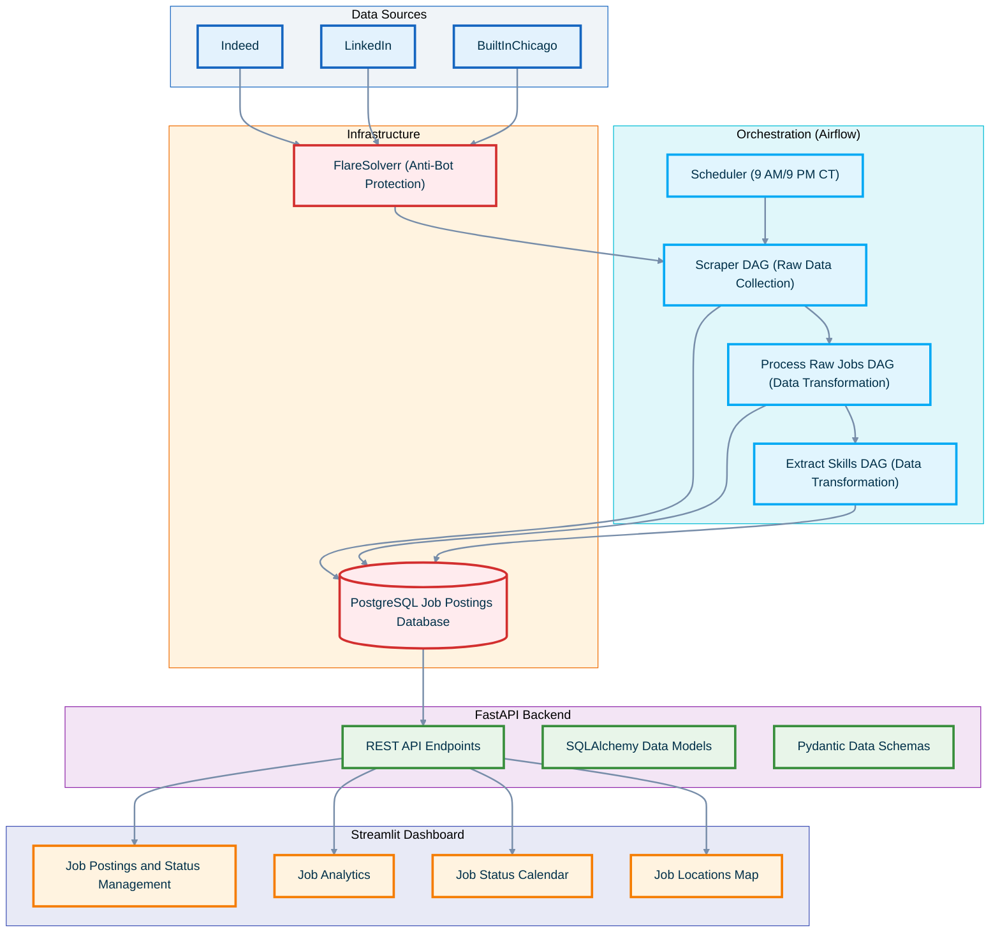

# Job Market Analytics Platform

A comprehensive data pipeline and analytics platform that automates job posting collection, processing, and visualization for the data/tech industry. Built with FastAPI, Airflow, Streamlit, and PostgreSQL.

## Overview
Job Compass is an ETL platform that helps job seekers track and analyze job postings. It automatically ingests job listings from multiple sources, processes the data, and provides interactive visualizations and analytics.

## System Architecture

### 1. Data Collection Layer
- Scheduled Airflow DAGs for job scraping
- Source-specific scrapers with error handling
- Raw data storage in PostgreSQL

### 2. Processing Layer
- Duplicates detection while scraping to ensure no repeated job entries
- Job data normalization adn enrichment
- Skill extraction and categorization
- Salary standardization
- Location data processing

###  3.Analytics Layer
- REST API for data access
- Interactive dashboard
- Real-time filtering and analysis

## Technology Stack

### Backend
- FastAPI: REST API with async support
- PostgreSQL: Primary database
- SQLAlchemy: ORM for database operations
- Pydantic: Data validation and settings management

### Data Pipeline
- Apache Airflow: Workflow orchestration
- Docker: Containerization
- Playwright: Web scrapign with browser automation
- FlareSolverr: Anti-bot bypass solution

### Frontend
- Streamlit: Interactive dashboard
- Plotly: Data visualization
- Pandas: Data manipulation
- Leaflet: Geographic visualization 

